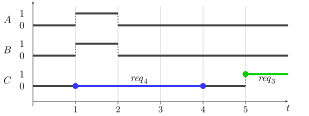
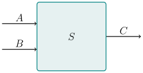
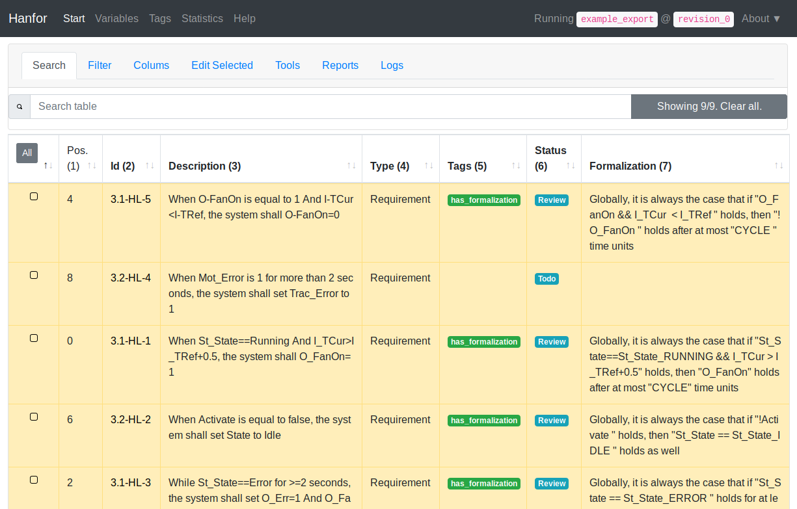
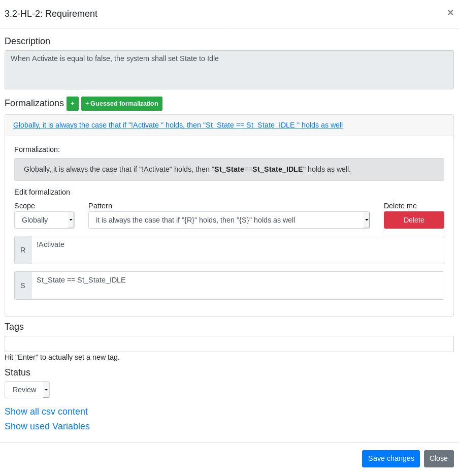

toc_depth: 4

# What is Hanfor?
**Hanfor** is a tool that **h**elps **an**alyzing and **fo**rmalizing **r**equirements.

The specification of requirements is a critical activity in software and system development. A defect in a requirement specification can result in a situation where a software or system is delivered that fullfills the given requirements, but does not satisfy the customer's needs due to erroneous requirments.

Requirement analysis, as a human activity, is error-prone. Especially for large sets of requirements, it is difficult and time consuming to manually check whether a given property is satisfied or not.

Requirement based testing is helpful to increase the efficiency during development. Obtaining a high test coverage on requirements often takes a long time. As the number of requirements increases over the releases, the test specifications have to cover more and more requirements. 

Hanfor is developed to ease the process of requirement analysis. Its method consists of three major steps to discover requirement defects and obtain test specifications based on a set of informal requirements (Figure 1):

1. Requirement Formalization
2. Requirement Check
3. Test Generation

!


## Requirement Formalization
To make it possible for a computer to check a set of requirements for a given criteria, it has to "understand" the semantics of the requirements. This could be achieved by using formal languages, which usually share the fact that they are rarely understandable for humans.

In this method we make use of a simple pattern language. The language is based on a restricted English grammar and hence looks like natural language. Requirements formalized in this specification language can automatically be translated into logics.


### Specification Language
The grammar of the specification language is given below. A requirement is defined by an ID, a scope and a pattern. Scope and pattern are parameterised by expressions over system observables and durations. Some patterns require a more detailed description concerning the order or the realtime occurence of events. Note that not all combinations of scope and pattern are supported within the **Hanfor** tool. For more information, have a look at our [pattern section](../references/patterns.md "Patterns").

???+ note "Grammar: Requirements"
    ```
    REQ       ::= ID: SCOPE, PATTERN.

    SCOPE     ::= Globally | Before EXPR | After EXPR | Between EXPR and EXPR | After EXPR until EXPR

    PATTERN   ::= It is never the case that EXPR holds
                | It is always the case that EXPR holds
                | It is always the case that initially EXPR holds 
                | It is always the case that if EXPR holds, then EXPR holds as well
                | Transitions to states in which EXPR holds occur at most twice
                | It is always the case that ORDER
                | It is always the case that REALTIME

    ORDER     ::= If EXPR holds, then EXPR previously held
                | If EXPR holds and is succeded by EXPR, then EXPR previously held
                | If EXPR holds, then EXPR previously held and was preceeded by EXPR
                | If EXPR holds, then EXPR eventually holds and is succeeded by EXPR
                | If EXPR holds, then EXPR eventually holds
                | If EXPR holds, then EXPR eventually holds and is succeeded by EXPR where 
                     EXPR does not hold between EXPR and EXPR

    REALTIME  ::= Once EXPR becomes satisfied, it holds for at least DURATION
                | Once EXPR becomes satisfied, it holds for less than DURATION
                | Once EXPR becomes satisfied, EXPR holds for at least DURATION
                | Once EXPR becomes satisfied and holds for at most DURATION, then EXPR holds afterwards
                | Once EXPR becomes satisfied, EXPR holds after at most DURATION
                | Once EXPR becomes satisfied, EXPR holds after at most DURATION for at least DURATION
                | EXPR holds at least every DURATION
                | EXPR holds after at most DURATION
                | If EXPR holds, then EXPR holds after at most DURATION
                | If EXPR holds for at least DURATION, then EXPR holds afterwards for at least DURATION
                | If EXPR holds for at least DURATION, then EXPR holds after at most DURATION
                | If EXPR holds for at least DURATION, then EXPR holds afterwards
                | If EXPR holds, then EXPR holds after at most DURATION for at least DURATION
                | If EXPR holds, then EXPR holds for at least DURATION
                | After EXPR holds for at least DURATION and EXPR holds, then EXPR holds
                | After EXPR holds for at least DURATION and EXPR holds, then EXPR holds after at most DURATION

    ```

???+ note "Grammar: Expressions"
    ```
    EXPR      ::= EXPR_BOOL
                | EXPR_INT
                | EXPR_REAL
                | EXPR <==> EXPR
                | EXPR ==> EXPR
                | EXPR && EXPR
                | EXPR || EXPR
                | EXPR == EXPR
                | EXPR != EXPR
                | !EXPR
                        
    EXPR_BOOL ::= true | false | ID_BOOL

    EXPR_INT  ::= INT OP INT

    EXPR_REAL ::= REAL OP REAL

    INT       ::= NUMBER_INT | ID_INT | OP_UNARY INT

    REAL      ::= NUMBER_REAL | ID_REAL | OP_UNARY REAL

    OP        ::= == | != | < | <= | > | >= | + | - | * | /

    OP_UNARY  ::= + | -
    ```

Figure 2 shows the toolchain for the translation of an informal requirement into a formalized version. In the first step, the informal requirement, given in natural language, is translated into the specification language. This process is done manually. The requirement expressed in the specification language is then automatically translated into a formula in realtime logic (the Duration Calculus).

!


## Requirement Check
The **Hanfor** tool chain checks requirements for the following three correctness properties: 
  
  * Consistency
  * Realtime-consistency
  * Vacuity

### Consistency
A set of requirements is inconsistent, if there exists no system satisfying all requirements in the set.

Consider the two requirements in the specification language given below. This set of requirements is obviously not consistent as there is no interpretation where the observable 'A' evaluates both to *true* and to *false* at each point in time.

!!! example "Example 1: Inconsistent requirements"
    * ``Req1: Globally, it is never the case that 'A' holds.``
    * ``Req2: Globally, it is always the case that 'A' holds.``

Inconsistency in a set of requirements can be resolved by erasing or changing requirements. 


### Realtime-consistency (rt-consistency)
A set of requirements is rt-inconsistent, if there are conflicts between requirements that arise after a certain time.

!!! example "Example 2: Rt-inconsistent requirements"
    * ``Req3: Globally, it is always the case that if 'B' holds then 'C' holds after at most '5' time units.``
    * ``Req4: Globally, it is always the case that if 'A' holds then '!C' holds for at least '2' time units.``

Consider the two real-time requirements given above. The set of the two requirements is consistent. Figure 3 gives an example of an interpretation of 'A', 'B', and 'C' (in form of a timing diagram) that satisfies both requirments.

!

However, there are assignments for which the requirements are in conflict, as depicted in the example trace (Figure 4). If 'A' and 'B'change values as shown in the figure, than at time 5, Req4 would only be satisfied if 'C' remained *false* while Req3 would only be satisfied if 'C' changed to *true*.

!


There are several possibilities to resolve the rt-inconsistency in a set of requirements, e.g. by erasing, changing or adding requirements.

!!! example "Example 2 (Cont.): Resolving rt-inconsistency"
    * Erasing requirements
        * e.g. Erase Req4
    * Changing requirements
        * e.g. Make Req4 less restrictive:

            ``Req4': Globally, it is always the case that if 'A' holds and 'B' did not hold in the last 5 time units, then '!C' holds for at least '2' time units.``

    * Adding requirements
        * e.g. Add the following requirement:
        
            ``Req5: Globally, it is always the case that if 'B' holds, '!A' holds for at least 5 time units.``


### Vacuity
A set of requirements is vacuous, if the behaviour specified by the requirements cannot be triggered in a system satisfying all requirements. More intuitively spoken, a vacuous requirement can be imagined as dead code in an implementation: Both a vacouous requirement as well as dead code can be removed without changing the meaning of the remaining part.

Consider again the requirements Req1 and Req4 given below. The set of requirements is consistent. However, the precondition of Req4 is never true as this would violate Req1. Req4 is therefore vacuously satisfied in this set of requirements.

!!! example "Example 3: Vacuous requirements"
    * ``Req1: Globally, it is never the case that 'A' holds.``
    * ``Req4: Globally, it is always the case that if 'A' holds then '!C' holds for at least '2' time units.``


There are several possibilities to resolve vacuity in a set of requirements. 

!!! example "Example 3 (cont.): Resolving vacuity"
    * Erasing requirements
        * e.g. Erase Req1
    * Changing requirements
        * e.g. Make Req1 less restrictive:
            
            ``Req2': Before "Startup", it is never the case that 'A'holds.``

## Test Generation
Formalized requirements can be used to automatically generate test specifications. An automatic test generation helps to reduce the time needed to write test specifications with a high coverage rate. The efficiency during development can be increased and the maintainability costs can be reduced.


### Algorithm
Testing requires information about observability. The system variables are therefore categorized into input, output, and hidden (i.e. internal) variables. A sequence of inputs deterministically causes the valuation of the output variable. Figure 5 shows an abstract view of a two-input system with the variables *A*, *B* and *C*. 

!

The test generation algorithm automatically generates system tests that are based only on the formalized requirements (i.e. do not depend on an additional system model). It generates at least one test case per output variable, but as most as many test cases such that every requirement is tested. Each generated test indicates the requirements that it is based on.

It is ensured that the generated tests may not lead to false positives (i.e. the test case fails, although the system state is conform with the requirements).
In case that there exist untestable requirements, the algorithm lists the set of untestable requirements.


### Test Cases
The test cases generated by Hanfor contain three sorts of information:

  1. A sequence of *n* inputs: The initial state of the system, as well as the inputs for steps *1* to *n*.
  2. The expected outcome: The expected valuation of the tested output variable. 
  3. The indication on which requirements the test is based on.


Consider the set of requirements given below. The variables *A*, *B* are considered to be inputs of the system (Figure 5), *H* and *I* are hidden variables, and *C* represents the output of the system.

!!! example "Example 4: Requirements to be tested"
    * ``Req1: Globally, it is always the case that if ‘A’ holds then ‘H’ holds after at most ‘10’ time units.``
    * ``Req2: Globally, it is always the case that if ‘B’ holds then ‘I’ holds after at most ‘10’ time units.``
    * ``Req3: Globally, it is always the case that if ‘H AND I’ holds then ‘C’ holds after at most ‘10’ time units.``


The test generation tool outputs the following test case:

```
Case SystemTest:
TestGeneratorResult:
Found Test for: [C]
Test Vector:
Set inputs:
A := true, B := true
Wait for at most 20 for:
C == true, (req3)
```

The given test case tests the output variable *C* based on the third requirement. The input sequence is specified by an initial state only, in which both input variables *A* and *B* are set to *true*. The output variable *C* is expected to evaluate to *true* after at most 20 time units.


## Tool support

Hanfor takes as input an exported .csv file from Doors and stores the requirements. Figure 7 shows a screenshot of requirements imported into a Hanfor session.
There are two IDs, the Hanfor ID and the Doors ID, so that the two databases can be synchronized. The informal requirements are listed in the column 'Description'. Once a requirement is formalized in the specification language, it is listed in the column 'Formalization'. 

!

Clicking on a requirement opens the modification page of the requirement (Figure 8). The requirement can be formalized in the specification language by using the drop-down lists for both scopes and patterns. The variables can be specified manually by using the autocomplete function of the signal database.

!

For more information about the usage of Hanfor, please have a look at the usage section.
